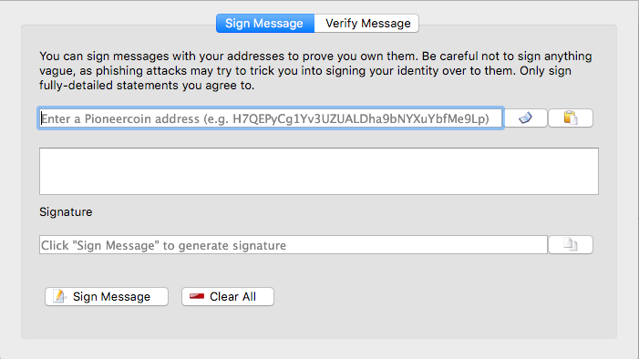
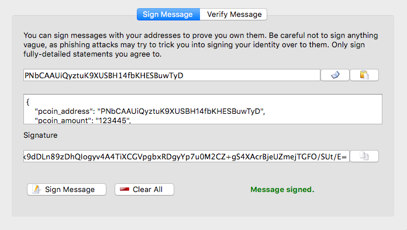

# Pioneercoin burning mechanism

**NOTE** coin burning is not yet active. Do not burn any tokens yet.

The effort to keep the Pioneercoin community alive centers around transferring
pcoin into PRT, a token on the ethereum network.

This repository contains the information on how to burn your pcoin and ensure
that you receive the correct amount of PRT. This mechanism strives to be 
secure so that only the person owning the original pcoin can nominate the 
ethereum address to receive the PRT.

There are two main transfer methods:
- Using pioneercoin wallet
- Directly from an exchange

Both mechanisms are centered around sending a signed message to the PRT developers.

## Create the burn notice

The burn notice is a json object satisfying the json schema
 [message_schema.json](message_schema.json).

The script [validate_message.py](validate_message.py) is able to verify that the
message is in the correct format.

The recommended way of creating the message is to copy [message_sample.txt](message_sample.txt)
and replace the contents with your burn details.

### Validate message

When the message is created, validate that it is well formed with:

```
> python validate_message.py --file [your_message_file]
Message is valid!
```

If there is a problem with the message an error will be displayed which
explains what doesn't match the schema. For example if the pcoin_address is too
long:

```
Error with message:
'PLdj5g0Wk010SRK0C2knSW3knf2cf0k173a' is too long

Failed validating 'maxLength' in schema['properties']['pcoin_address']:
    {'description': 'The pcoin address the transfer initiated from',
     'maxLength': 34,
     'minLength': 34,
     'type': 'string'}

On instance['pcoin_address']:
    'PLdj5g0Wk010SRK0C2knSW3knf2cf0k173a'
```

## Signing the burn notice

How the message is signed will depend on how you will transfer your pcoin to the
burn address.

### Using pioneercoin wallet

Pionercoin wallet has the built in ability to sign messages with the private key
of the loaded pioneercoin account.



#### Sign message

Select the address for the account that you sent the pioneer coin from. This 
should be the same one included in the message body.

Copy the complete contents of your message file and paste it into the message
field in the UI.

Sign the message.



#### Deliver burn notice

Compose an email to info[at]pioneercoin.io include the pcoin address used to
sign the message, the signature, and attach the message file.

Once the message is verified and the transaction appears on the pioneercoin
blockchain your PRT tokens will be transfered to the nominated etheruem address.

### Using an exchange

**IMPORTANT** For this burn method the message must be sent **before** transferring
your pcoin to the burn address. This is for your own protection so that someone
cannot submit a burn notice for your transaction before you are able to.

To sign your message you will need a public and private pem key.

If you already have a public/private key pair you would like to use, skip the next
section.

#### Generate keys

If you do not have keys, or want to use keys, they can be generated with:

```
python sign_message.py create_keys --public [public_key_file] --private [private_key_file]
```

This will generate a new private/public key pair in the files specified.

#### Sign message

Sign the message with:

```
python sign_message.py sign --message [message_file] --key [private_key_file] --signature [signature_file]
```

This will sign the message and write the signature to ```signature_file``` specified.

#### Deliver burn notice

Compose an email to info[at]pioneercoin.io include the public key of the key pair used to
sign the message, and attach the message file and the signature file.

**Now** transfer your pcoin to the burn address from your exchange account.

Once the message is verified and the transaction appears on the pioneercoin
blockchain your PRT tokens will be transfered to the nominated etheruem address.

If your transaction appears on the blockhain before the burn notice was received
your burn notice will be rejected.